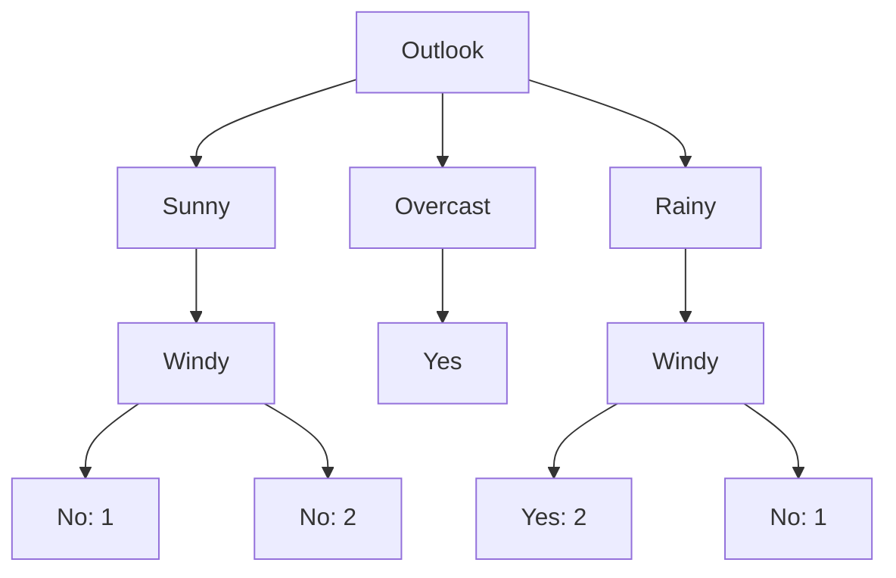

---

## 🧠 **Linear Regression: Inti Konsep**

Linear Regression bertujuan mencari garis lurus terbaik yang bisa **memprediksi nilai kontinu (Y)** dari sebuah fitur (X).

Kita ingin mencari:

$$
\hat{y} = w \cdot x + b
$$

* $w$: koefisien (kemiringan)
* $b$: bias/intersep
* $\hat{y}$: hasil prediksi
* $x$: input
* $y$: nilai sebenarnya

---

## 📊 **Data Kasus:**

Usia pengguna dan jam menonton YouTube:

```python
age         = [15, 18, 21, 25, 30, 35]
watch_hours = [2, 3, 3.5, 4, 4.5, 5]
```

---

## 🔢 **Langkah-Langkah Perhitungan Algoritma Linear Regression (Secara Analitik)**

---

### ✅ **1. Hitung Rata-Rata (Mean) dari X dan Y**

$$
\bar{x} = \frac{1}{n} \sum x_i,\quad \bar{y} = \frac{1}{n} \sum y_i
$$

Untuk data:

* $\bar{x} = \frac{15 + 18 + 21 + 25 + 30 + 35}{6} = 24$
* $\bar{y} = \frac{2 + 3 + 3.5 + 4 + 4.5 + 5}{6} = 3.67$

---

### ✅ **2. Hitung Koefisien (Slope) w**

$$
w = \frac{\sum (x_i - \bar{x})(y_i - \bar{y})}{\sum (x_i - \bar{x})^2}
$$

Hitung komponen satu per satu:

| $x_i$      | $y_i$ | $x_i - \bar{x}$ | $y_i - \bar{y}$ | $(x_i - \bar{x})(y_i - \bar{y})$ | $(x_i - \bar{x})^2$ |
| ---------- | ----- | --------------- | --------------- | -------------------------------- | ------------------- |
| 15         | 2     | -9              | -1.67           | 15.03                            | 81                  |
| 18         | 3     | -6              | -0.67           | 4.02                             | 36                  |
| 21         | 3.5   | -3              | -0.17           | 0.51                             | 9                   |
| 25         | 4     | 1               | 0.33            | 0.33                             | 1                   |
| 30         | 4.5   | 6               | 0.83            | 4.98                             | 36                  |
| 35         | 5     | 11              | 1.33            | 14.63                            | 121                 |
| **Jumlah** |       |                 |                 | **39.5**                         | **284**             |

$$
w = \frac{39.5}{284} \approx 0.1391
$$

---

### ✅ **3. Hitung Bias (Intercept) b**

$$
b = \bar{y} - w \cdot \bar{x}
$$

$$
b = 3.67 - 0.1391 \cdot 24 \approx 0.33
$$

---

### ✅ **4. Buat Fungsi Prediksi**

$$
\hat{y} = 0.1391 \cdot x + 0.33
$$

Prediksi untuk usia 28:

$$
\hat{y} = 0.1391 \cdot 28 + 0.33 \approx 4.22 \text{ jam}
$$

---

## 📈 **Loss Function: Mean Squared Error (MSE)**

$$
\text{MSE} = \frac{1}{n} \sum (\hat{y}_i - y_i)^2
$$

Tujuan Linear Regression adalah **meminimalkan MSE**, biasanya menggunakan **analitik** (seperti di atas) atau **gradient descent** (untuk data besar/dengan banyak fitur).

Bagus! Mari kita fokus pada **evaluasi model Linear Regression menggunakan MSE (Mean Squared Error)**, yang sangat penting dalam mengevaluasi seberapa baik model kita memprediksi.

---

## 🔍 **Apa itu MSE (Mean Squared Error)?**

**MSE** mengukur rata-rata **kuadrat dari selisih antara nilai prediksi $\hat{y}_i$** dan **nilai aktual $y_i$**.

### 🔢 **Formula:**

$$
\text{MSE} = \frac{1}{n} \sum_{i=1}^{n} (y_i - \hat{y}_i)^2
$$

* $y_i$ = nilai aktual
* $\hat{y}_i$ = nilai prediksi dari model
* $n$ = jumlah data

---

## 📊 **Gunakan Data Sebelumnya:**

| $x_i$ | $y_i$ (aktual) | $\hat{y}_i = 0.1391 \cdot x + 0.33$ | $(y_i - \hat{y}_i)^2$        |
| ----- | -------------- | ----------------------------------- | ---------------------------- |
| 15    | 2              | $0.1391 \cdot 15 + 0.33 = 2.4165$   | $(2 - 2.4165)^2 = 0.1734$    |
| 18    | 3              | $0.1391 \cdot 18 + 0.33 = 2.8338$   | $(3 - 2.8338)^2 = 0.0276$    |
| 21    | 3.5            | $0.1391 \cdot 21 + 0.33 = 3.2511$   | $(3.5 - 3.2511)^2 = 0.0619$  |
| 25    | 4              | $0.1391 \cdot 25 + 0.33 = 3.8075$   | $(4 - 3.8075)^2 = 0.0371$    |
| 30    | 4.5            | $0.1391 \cdot 30 + 0.33 = 4.503$    | $(4.5 - 4.503)^2 = 0.000009$ |
| 35    | 5              | $0.1391 \cdot 35 + 0.33 = 5.1985$   | $(5 - 5.1985)^2 = 0.0394$    |

### 🧮 **Total MSE:**

$$
\text{MSE} = \frac{0.1734 + 0.0276 + 0.0619 + 0.0371 + 0.000009 + 0.0394}{6} = \frac{0.3394}{6} \approx 0.0566
$$

---

## ✅ **Interpretasi MSE**

* Nilai MSE kecil → model cukup baik.
* Nilai MSE besar → model prediksi jauh dari data aktual.

---

## ⚠️ **Kelemahan MSE:**

1. **Sensitif terhadap outlier:** karena kesalahan dikuadratkan, outlier (data ekstrem) bisa memperbesar error secara signifikan.
2. **Tidak sebanding satuan:** satuan MSE adalah kuadrat dari satuan target. Misal: target = "jam", maka MSE = "jam²", sehingga agak sulit diinterpretasikan langsung.
3. **Tidak bisa dibandingkan antar skala:** jika digunakan antar dataset berbeda skala, hasil MSE tidak bisa langsung dibandingkan.

---

## 💡 **Solusi Alternatif (Selain MSE):**

* **RMSE (Root Mean Squared Error):** akar dari MSE → balik ke satuan asli
* **MAE (Mean Absolute Error):** rata-rata dari selisih absolut, lebih tahan terhadap outlier
* **R² Score (Coefficient of Determination):** proporsi variasi data yang bisa dijelaskan model


---

## 🔁 Ringkasan Proses:

1. Hitung rata-rata X dan Y
2. Hitung slope (w) dan bias (b)
3. Bentuk persamaan regresi
4. Gunakan untuk prediksi
5. Evaluasi model dengan MSE

---


## 🧠 **Apa itu Logistic Regression?**

Logistic Regression adalah algoritma *supervised learning* untuk **klasifikasi** (bukan regresi seperti namanya!). Biasanya digunakan saat target/output adalah **biner** (misal: 0 atau 1, spam atau tidak spam, sakit atau sehat).

---

## ✅ **Kapan digunakan?**

Digunakan ketika:

* Ingin **memprediksi probabilitas** dari dua kelas.
* Output target adalah **diskrit** (binary atau multi-class).

Contoh kasus:

* Prediksi apakah email adalah spam (1) atau bukan (0)
* Prediksi apakah pasien sakit (1) atau sehat (0) berdasarkan gejala
* Prediksi pelanggan akan churn (1) atau tidak (0)

---

## 🧪 **Bagaimana cara kerjanya?**

1. Seperti Linear Regression, ia hitung nilai prediksi linear:

   $$
   z = w \cdot x + b
   $$

2. Namun hasilnya diubah ke **probabilitas** antara 0 sampai 1 menggunakan **fungsi sigmoid**:

   $$
   \hat{y} = \sigma(z) = \frac{1}{1 + e^{-z}}
   $$

3. Jika $\hat{y} \geq 0.5$, maka kelas = 1, jika tidak maka kelas = 0.

---

## 📊 **Contoh Data Sederhana:**

| Umur (X) | Punya Asuransi (Y: 1=Ya, 0=Tidak) |
| -------- | --------------------------------- |
| 20       | 0                                 |
| 25       | 0                                 |
| 30       | 1                                 |
| 35       | 1                                 |

Kita akan melatih model untuk **memprediksi apakah seseorang akan membeli asuransi berdasarkan umur**.

---

## 📐 **Langkah-Langkah Perhitungan Logistic Regression:**

### **1. Hitung z (kombinasi linear):**

Misal bobot awal $w = 0.25$, bias $b = -7$

$$
z = w \cdot x + b
$$

Contoh pada umur 30:

$$
z = 0.25 \cdot 30 - 7 = 0.5
$$

---

### **2. Hitung Sigmoid dari z (probabilitas kelas 1):**

$$
\hat{y} = \frac{1}{1 + e^{-0.5}} \approx 0.6225
$$

> Artinya, model memperkirakan 62% kemungkinan orang usia 30 akan beli asuransi.

---

### **3. Tentukan Prediksi Kelas:**

Jika:

* $\hat{y} \geq 0.5 \Rightarrow \text{Prediksi: 1 (punya asuransi)}$
* $\hat{y} < 0.5 \Rightarrow \text{Prediksi: 0 (tidak punya)}$

---

### **4. Fungsi Loss: Binary Cross-Entropy**

$$
\mathcal{L}(y, \hat{y}) = - [y \cdot \log(\hat{y}) + (1 - y) \cdot \log(1 - \hat{y})]
$$

Untuk evaluasi seberapa buruk prediksi dari model.

---

## 🎯 Kesimpulan Konsep

| Komponen       | Penjelasan Singkat                                  |
| -------------- | --------------------------------------------------- |
| Masalah        | Klasifikasi (binary)                                |
| Model          | Linear + fungsi sigmoid                             |
| Output         | Probabilitas (0 sampai 1)                           |
| Prediksi akhir | Kelas 0 atau 1 berdasarkan threshold (default: 0.5) |
| Evaluasi       | Binary cross-entropy loss                           |

---

Dalam **Logistic Regression**, fungsi loss utama yang digunakan adalah:

---

## 🔹 1. **Binary Cross-Entropy Loss** (biasa juga disebut *log loss*)

### 🧠 Digunakan saat:

* **Klasifikasi biner** (2 kelas: 0 atau 1)

### 💡 Formula:

$$
\mathcal{L}(y, \hat{y}) = -\left[y \cdot \log(\hat{y}) + (1 - y) \cdot \log(1 - \hat{y})\right]
$$

* $y$ adalah label asli (0 atau 1)
* $\hat{y}$ adalah probabilitas prediksi (output sigmoid)

### 🛠️ Kenapa digunakan:

* Mendorong model menghasilkan probabilitas mendekati label sebenarnya.
* Penalti besar diberikan jika prediksi jauh dari label benar (misal prediksi 0.01 tapi label aslinya 1).

---

## 🔹 2. **Categorical Cross-Entropy** (untuk multi-class)

### 🧠 Digunakan saat:

* Klasifikasi **lebih dari 2 kelas**
* Biasanya dengan fungsi **softmax** di output layer

### 💡 Formula:

$$
\mathcal{L}(y, \hat{y}) = -\sum_{i=1}^{C} y_i \cdot \log(\hat{y}_i)
$$

* $C$ adalah jumlah kelas
* $y_i$ adalah one-hot label kelas ke-i
* $\hat{y}_i$ adalah probabilitas prediksi kelas ke-i

---

## 🔹 3. **Hinge Loss** (jarang dipakai di logistic regression, lebih umum di SVM)

### 🧠 Digunakan saat:

* Ingin margin-based classification seperti SVM
* Kurang cocok untuk probabilistik model seperti logistic regression

---

### ⚠️ Catatan:

* **Loss bukan sekadar error**: ia adalah fungsi objektif yang dioptimasi oleh algoritma (dalam hal ini, dengan **gradient descent**).
* Logistic regression **tidak cocok** menggunakan **MSE (mean squared error)** sebagai loss karena output-nya adalah probabilitas (non-linear), dan ini bisa membuat proses training **lambat konvergen**.

---

**Kesimpulan**:
Untuk **logistic regression biner**, *Binary Cross-Entropy* adalah **standar loss function**, karena selaras dengan sifat probabilistik model dan fungsi sigmoid.

---

## Decision Tree

---

### **1. Konsep Dasar Decision Tree**  
Decision Tree adalah algoritma yang membangun struktur pohon dengan **node keputusan** (berdasarkan fitur) dan **leaf node** (kelas prediksi). Tujuannya adalah mempartisi data secara rekursif hingga setiap subgroup murni (homogen) atau memenuhi kriteria berhenti.

---

### **2. Contoh Data Sederhana**  
Kita gunakan dataset tentang **apakah seseorang akan bermain tenis** berdasarkan 4 fitur:  
| Outlook  | Temperature | Humidity | Windy | Play? |
|----------|-------------|----------|-------|-------|
| Sunny    | Hot         | High     | No    | No    |
| Sunny    | Hot         | High     | Yes   | No    |
| Overcast | Hot         | High     | No    | Yes   |
| Rainy    | Mild        | High     | No    | Yes   |
| Rainy    | Cool        | Normal   | No    | Yes   |
| Rainy    | Cool        | Normal   | Yes   | No    |
| Overcast | Cool        | Normal   | Yes   | Yes   |
| Sunny    | Mild        | High     | No    | No    |

**Target**: Kolom "Play?" (Yes/No).

---

### **3. Langkah Pembuatan Decision Tree**  
#### **Langkah 1: Pilih Fitur Terbaik untuk Root Node**  
Gunakan **metrik impurity** (ketidakmurnian) seperti **Gini Index** atau **Entropy** untuk memilih fitur yang paling memisahkan kelas.

**Rumus Gini Index**:  
$Gini(D) = 1 - \sum_{i=1}^k (p_i)^2$  
di mana $p_i$ adalah proporsi kelas ke-$i$ di dataset $D$.

**Contoh Perhitungan untuk Fitur "Outlook"**:  
- **Sunny**: 3 sampel (2 No, 1 Yes) → Gini = $1 - \left(\frac{2}{3}\right)^2 - \left(\frac{1}{3}\right)^2 = 0.444$  
- **Overcast**: 2 sampel (2 Yes) → Gini = $1 - (1)^2 - (0)^2 = 0$ (murni)  
- **Rainy**: 3 sampel (2 Yes, 1 No) → Gini = $0.444$

**Weighted Gini untuk "Outlook"**:  
$Gini_{Outlook} = \left(\frac{3}{8}\right) \times 0.444 + \left(\frac{2}{8}\right) \times 0 + \left(\frac{3}{8}\right) \times 0.444 = 0.333$

**Hitung Gini untuk Fitur Lain**:  
- **Temperature**: 0.439  
- **Humidity**: 0.367  
- **Windy**: 0.428  

**Fitur dengan Gini terkecil (0.333) adalah "Outlook"** → Dipilih sebagai root node.  

---

#### **Langkah 2: Partisi Data Berdasarkan Fitur Terpilih**  
- **Outlook = Sunny**: 3 sampel (2 No, 1 Yes)  
- **Outlook = Overcast**: 2 sampel (2 Yes) → **Leaf Node (Yes)**  
- **Outlook = Rainy**: 3 sampel (2 Yes, 1 No)  

---

#### **Langkah 3: Bangun Sub-tree untuk "Sunny"**  
Hitung Gini untuk subset data "Sunny" (3 sampel):  
- **Temperature**:  
  - Hot: 2 sampel (2 No) → Gini = 0  
  - Mild: 1 sampel (1 No) → Gini = 0  
  Weighted Gini = $\frac{2}{3} \times 0 + \frac{1}{3} \times 0 = 0$

- **Humidity**:  
  - High: 3 sampel (2 No, 1 Yes) → Gini = 0.444

- **Windy**:  
  - No: 1 sampel (1 No) → Gini = 0  
  - Yes: 2 sampel (2 No) → Gini = 0  
  Weighted Gini = $\frac{1}{3} \times 0 + \frac{2}{3} \times 0 = 0$

**Pilih fitur dengan Gini terendah (0)**: "Temperature" atau "Windy"  
Misal pilih **"Windy"** sebagai node:  
- **Windy = No**: 1 No → **Leaf (No)**  
- **Windy = Yes**: 2 No → **Leaf (No)**  

---

#### **Langkah 4: Bangun Sub-tree untuk "Rainy"**  
Subset "Rainy" (3 sampel):  
- **Windy**:  
  - No: 2 sampel (2 Yes) → Gini = 0  
  - Yes: 1 sampel (1 No) → Gini = 0  
  Weighted Gini = $\frac{2}{3} \times 0 + \frac{1}{3} \times 0 = 0$

**Pilih "Windy" sebagai node**:  
- **Windy = No**: 2 Yes → **Leaf (Yes)**  
- **Windy = Yes**: 1 No → **Leaf (No)**  

---

### **4. Struktur Pohon Final**  

### 5. Rumus Penting dalam Decision Tree
#### a. Gini Index
$Gini(D) = 1 - \sum_{i=1}^k (p_i)^2$

$D$: Dataset

$p_i$: Proporsi kelas ke-$i$

#### b. Entropy
$Entropy(D) = -\sum_{i=1}^k p_i \log_2(p_i)$

#### c. Information Gain
$IG(D, F) = Entropy(D) - \sum_{v \in Values(F)} \frac{|D_v|}{|D|} Entropy(D_v)$

$F$: Fitur

$D_v$: Subset data dengan nilai $v$ untuk fitur $F$


### **7. Kelebihan & Kekurangan**

✅ **Kelebihan**:

-   Mudah diinterpretasikan (mirip flowchart)
    
-   Tidak butuh feature scaling
    
-   Handles non-linear relationships
    

❌ **Kekurangan**:

-   Rentan overfitting (perlu teknik pruning atau batas kedalaman)
    
-   Sensitif terhadap perubahan kecil di data
    

----------

### **8. Tips Praktis**

-   **Max Depth**: Batasi kedalaman pohon (`max_depth=3`)
    
-   **Min Samples Split**: Minimum sampel untuk split node (misal `min_samples_split=5`)
    
-   **Gini vs Entropy**: Kedua metrik biasanya hasil mirip, Gini lebih cepat

---
